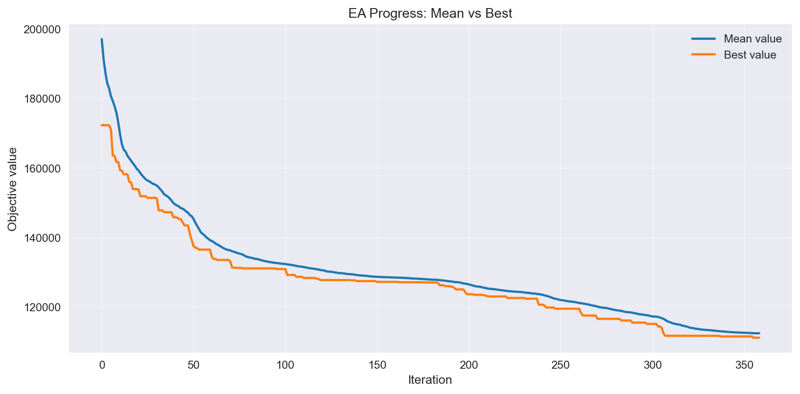
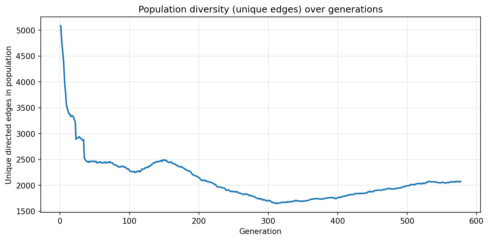

# Memetic Algorithm for the Traveling Salesperson Problem

> A high-performance evolutionary algorithm blending genetic operators with local search heuristics to solve the asymmetric Traveling Salesperson Problem (TSP).

---

## Overview

This project implements a **Memetic Algorithm (MA)** — a hybrid evolutionary approach that combines the global exploration of a **Genetic Algorithm** with the local exploitation of **hill-climbing heuristics** — to find near-optimal solutions to the **Asymmetric TSP**.

The algorithm is designed to handle distance matrices of varying sizes (50 to 1000+ cities) while respecting a **5-minute wall-clock time budget**. Population parameters are automatically tuned based on instance size.

---

## Key Features

| Component | Technique |
|---|---|
| **Initialisation** | 90% Randomised Greedy + 10% Random feasible tours |
| **Selection** | k-Tournament Selection (k=5) |
| **Crossover** | Order Crossover (OX) + Edge Recombination Crossover (ERX) |
| **Mutation** | Swap / Invert / Insert (randomly chosen per candidate) |
| **Local Search** | 2-opt (per generation) + 3-opt (on stagnation) |
| **Elimination** | (μ+λ) with duplicate filtering + Elitism + k-Tournament |
| **Diversity** | Duplicate removal, stagnation detection, greedy tour replacement |
| **Speed** | Numba JIT compilation for all inner loops |

---

## Algorithm Design

### Evolutionary Loop

```
Initialise population (greedy + random feasible tours)
  └─ while time remaining:
        Selection    →  k-tournament (k=5), always picks 2 distinct parents
        Crossover    →  OX or ERX with probability p_cross = 0.8
        Mutation     →  Swap / Invert / Insert with probability p_mut = 0.8
        Local Search →  2-opt (40% of offspring) or greedy replacement (10% prob)
        Elimination  →  (μ+λ), elitism + tournament, duplicate filtering
        Stagnation?  →  Apply 3-opt to top 10% of population
```

### Feasibility Handling

The distance matrix can contain `np.inf` entries (infeasible edges). All operators — initialisation, crossover, mutation, and local search — include **feasibility checks** and retry logic to ensure only valid tours (finite total length) enter the population.

### Adaptive Population Sizing

Population size (μ = λ) is scaled to the problem instance:

| Cities (n) | μ / λ |
|---|---|
| 1 – 60 | 100 |
| 61 – 260 | 150 |
| 261 – 510 | 350 |
| 511 – 800 | 450 |
| 800+ | 500 |

---

## Project Structure

```
.
├── TSP.py                  # Main algorithm (TSP class + Numba JIT functions)
├── Reporter.py             # CSV progress logger (provided by course)
├── plot_EA_progress.py     # Visualisation script for convergence plots
├── tour50.csv              # Test instance — 50 cities
├── tour250.csv             # Test instance — 250 cities
├── tour500.csv             # Test instance — 500 cities
├── tour750.csv             # Test instance — 750 cities
├── tour1000.csv            # Test instance — 1000 cities
├── TSP.csv                 # Reporter output (generated at runtime)
├── ea_progress.png         # Convergence plot (mean vs best fitness)
├── diversity_evolution.png # Population diversity over generations
└── README.md
```

---

### Visualise Convergence

```bash
python plot_EA_progress.py --csv TSP.csv --out ea_progress.png
```

---

## Results

The algorithm tracks and logs **mean population fitness** and **best fitness** at each generation via `Reporter.py`.

### Convergence Plot (tour250 example)



### Diversity Evolution



---

## Hyperparameters

| Parameter | Default | Description |
|---|---|---|
| `mu` | auto | Population size (auto-tuned by n) |
| `lamb` | auto | Offspring per generation (= μ) |
| `k_tournament` | 5 | Tournament size for selection & elimination |
| `mutation_rate` | 0.8 | Probability of mutating a child |
| `crossover_rate` | 0.8 | Probability of applying crossover |
| `feasible_retry` | 20 | Max retries to produce a feasible variation |
| `greedy_search_replacement_prob` | 0.1 | Probability of triggering greedy replacement |

---

## Implementation Notes

- **Numba JIT** (`@jit(nopython=True)`) is used for all compute-intensive inner loops: tour length calculation, 2-opt delta, 3-opt search, OX/ERX crossover, mutation operators, and tournament selection.
- **Stagnation handling**: if no improvement is seen for 10 consecutive generations, a 3-opt search is applied to the top 10% of the population.
- **Greedy replacement**: with a small probability, the worst offspring are discarded and replaced by tours reconstructed from their best edge via nearest-neighbour greedy search.
- The reporter enforces a **300-second time limit** and writes iteration, elapsed time, mean/best fitness, and the best tour to a CSV.

---

## Context

Developed as part of a **Genetic Algorithms and Evolutionary Computing** course. For this reason, the csv files were not uploaded.

---

## License

This project is for academic purposes. Please do not reuse for assessment submissions.
